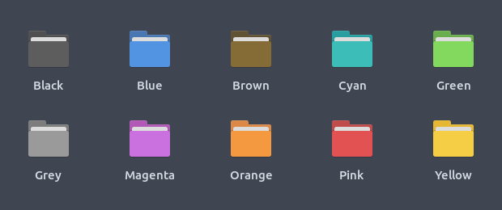
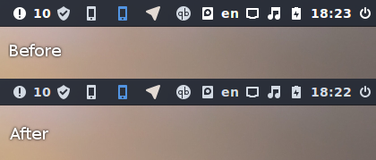

<p align="center">
  
</p>

<p align="center">
  
  
  
  
</p>

Papirus is a free and open source SVG icon theme for Linux, based on [Paper Icon Set](https://github.com/snwh/paper-icon-theme) with a lot of new icons and a few extras, like [Hardcode-Tray support](#hardcoded-tray-icons), [KDE colorscheme support](#kde-colorscheme), [Folder Color support](#folders-color), and [others](#extras).

Papirus icon theme is available in four variants:

 - Papirus (for a light theme with a dark panel)
 - Papirus Dark
 - Papirus Light
 - ePapirus (for elementary OS and Pantheon Desktop)

## Installation

### Ubuntu and derivatives

You can install Papirus from our official [PPA](https://launchpad.net/~papirus/+archive/ubuntu/papirus):

```
sudo add-apt-repository ppa:papirus/papirus
sudo apt-get update
sudo apt-get install papirus-icon-theme
```

or download .deb packages from [here](https://launchpad.net/~papirus/+archive/ubuntu/papirus/+packages?field.name_filter=papirus-icon-theme).

### Papirus Installer

Use the scripts to install the latest version directly from this repo (independently on your distro):

**NOTE:** Use the same script to update icon themes.

#### ROOT directory (recommended)

```
wget -qO- https://raw.githubusercontent.com/PapirusDevelopmentTeam/papirus-icon-theme/master/install-papirus-root.sh | sh
```
#### HOME directory for GTK

```
wget -qO- https://raw.githubusercontent.com/PapirusDevelopmentTeam/papirus-icon-theme/master/install-papirus-home-gtk.sh | sh
```

#### HOME directory for KDE

```
wget -qO- https://raw.githubusercontent.com/PapirusDevelopmentTeam/papirus-icon-theme/master/install-papirus-home-kde.sh | sh
```

**NOTE:** Qt4 apps require `libqt4-svg` to work correctly.

#### Remove

```
wget -qO- https://raw.githubusercontent.com/PapirusDevelopmentTeam/papirus-icon-theme/master/remove-papirus.sh | sh
```

### Unofficial packages

Packages in this section are not part of the official repositories. If you have a trouble or a question please contact with package maintainer.

| **Distro** | **Maintainer**    | **Package** |
|:-----------|:------------------|:------------|
| Arch Linux | Edgard Castro     | [papirus-icon-theme-git](https://aur.archlinux.org/packages/papirus-icon-theme-git/) (AUR) |
| Arch Linux | Josip Ponjavic    | [papirus-icon-theme-git](https://build.opensuse.org/package/show/home:metakcahura/papirus-icon-theme-git) (OBS) |
| Fedora     | Dirk Davidis      | [papirus-icon-theme](https://copr.fedorainfracloud.org/coprs/dirkdavidis/papirus-icon-theme/) (copr) |
| Manjaro    | Nikola Yanev      | [papirus-icon-theme](http://download.tuxfamily.org/gericom/README.html) |
| openSUSE   | Konstantin Voinov | [papirus-icon-theme](https://build.opensuse.org/package/show/home:kill_it/papirus-icon-theme) (OBS) |
| Solus      | Joshua Strobl     | `sudo eopkg install papirus-icon-theme` |

**NOTE:** If you maintainer and want be in the list please create an issue or send a pull request.

### Hardcoded tray icons

Papirus icon theme now supports [Hardcode-Tray](https://github.com/bil-elmoussaoui/Hardcode-Tray) script

**NOTE:** To get Papirus to work right with Hardcode-Tray, use the hardcode-tray option `--conversion-tool Inkscape`:

```
hardcode-tray --conversion-tool Inkscape
```


## KDE colorscheme

Support for monochrome icons for KDE colorscheme is now available:
- Papirus - for dark plasma theme & light color scheme
- Papirus Dark - for dark plasma theme & color scheme
- Papirus Light - for light plasma theme & color scheme


**NOTE:** Non-KDE apps don't support KDE colorscheme on the system tray, but you can replace color by manually.

<details>
<summary>What colors are used for monochrome icons on KDE?</summary>

**Papirus**:
- actions, devices, places
  - class: **ColorScheme-Text** color: `#5c616c`
  - class: **ColorScheme-Highlight** color: `#5294e2`
- panel
  - class: **ColorScheme-ButtonBackground** color: `#d3dae3`
  - class: **ColorScheme-Highlight** color: `#5294e2`

**Papirus-Dark**:
- actions, devices, places and panel
  - class: **ColorScheme-Text** color: `#d3dae3`
  - class: **ColorScheme-Highlight** color: `#5294e2`

**Papirus-Light**:
- actions, devices, places and panel
  - class: **ColorScheme-Text** color: `#5c616c`
  - class: **ColorScheme-Highlight** color: `#5294e2`
</details>

## Folder's color

Papirus has [Folder colors](http://foldercolor.tuxfamily.org/) support that allows you to change a global color of folders or just one of them.

Available colors:



## Extras

- [Papirus theme for LibreOffice](https://github.com/PapirusDevelopmentTeam/papirus-libreoffice-theme)
- [Papirus themes for FileZilla](https://github.com/PapirusDevelopmentTeam/papirus-filezilla-themes)
- [Papirus theme for SMPlayer](https://github.com/PapirusDevelopmentTeam/papirus-smplayer-theme)

## Recommendations

- For GTK, better use icons alongside GTK theme [Arc Theme](https://github.com/horst3180/arc-theme)
- For KDE, better use alongside [Arc KDE](https://github.com/PapirusDevelopmentTeam/arc-kde)

## Manual fixes

<details>
<summary>For Cinnamon users</summary>

For Cinnamon users who want use Papirus icon theme with [arc-theme](https://github.com/horst3180/arc-theme), we recommend the following combinations:

**light theme**

- Window borders `Arc` or `Arc-Darker`
- Icons `ePapirus`
- Controls `Arc` or `Arc-Darker`
- Desktop `Arc` or `Arc-Dark`

**dark theme**

- Window borders `Arc-Dark`
- Icons `Papirus-Dark`
- Controls `Arc-Dark`
- Desktop `Arc-Dark` with an another color for tray icons:

```
sudo sed -i.orig 's/white/#d3dae3/g' /usr/share/themes/Arc-Dark/cinnamon/cinnamon.css
```



Also, increase panel size with `Allow Cinnamon to scale panel text and icons according to the panel height` option because Papirus contains only 22px and 24px panel's icons.
</details>

<details>
<summary>For Unity users</summary>

For Unity users, we recommend installing patched [Notify-OSD](https://launchpad.net/~leolik/+archive/ubuntu/leolik) and change an icon size to 33px.

*~/.notify-osd* file:

```
slot-allocation = dynamic
bubble-expire-timeout = 10sec
bubble-vertical-gap = 10px
bubble-horizontal-gap = 10px
bubble-corner-radius = 24px
bubble-icon-size = 33px
bubble-gauge-size = 6px
bubble-width = 240px
bubble-background-color = 2f343f
bubble-background-opacity = 95%
text-margin-size = 10px
text-title-size = 100%
text-title-weight = bold
text-title-color = adb7bf
text-title-opacity = 100%
text-body-size = 90%
text-body-weight = normal
text-body-color = eaeaea
text-body-opacity = 100%
text-shadow-opacity = 50%
location = 1
bubble-prevent-fade = 1
bubble-close-on-click = 1
bubble-as-desktop-bg = 0
```


Also, you can change [Unity launcher icon](https://github.com/PapirusDevelopmentTeam/papirus-icon-theme/tree/master/Papirus/extra/unity) and [unity-tweak-tool icons](https://github.com/PapirusDevelopmentTeam/papirus-icon-theme/tree/master/Papirus/extra/unity-tweak-tool). Look into the extra folder in the icon theme.
</details>

## Icon request

- Application name
- Icon name (see desktop-file option **Icon** on `/usr/share/applications`)
- Original icon image

## Contribute

We welcome user contributions. If you don't know where to start, we've compiled a list of things they would like to see in your pull request:

- new icons for missing applications
- symbolic links to an existing icon
- resolving open issues
- spelling, grammar, phrasing
- improvements to our scripts

Inside [tools/work](tools/work) you find a step-by-step guide, an environment, and tools that help you:

- [create a new icon](tools/work#create-a-new-icon) from template
- [make a symlink to an existing icon](tools/work#make-symlinks-to-an-existing-icon)
- [edit an existing icon](tools/work#edit-an-existing-icon)
- convert your icon to all variants the theme

We are waiting for your pull requests and would love to see this icon theme become as complete as possible.

## Donate

<span class="paypal"><a href="https://www.paypal.me/varlesh" title="Donate to this project using Paypal"></a></span>

BTC: `1HwE62Zb8PyyY1XAR6Ykweix2ht8NAjvf5`

## License

GNU LGPL v3.0
