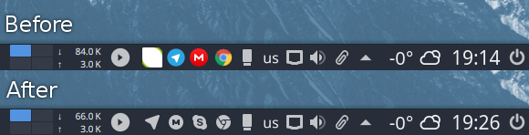
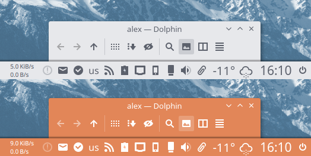

<p align="center">
  
</p>

<p align="center">
  
  
  
  
</p>

# About
Papirus - A free  and open source SVG icon theme for Linux systems, based on [Paper](https://github.com/snwh/paper-icon-theme) with a few extras like ([hardcode-tray support](#hardcoded-tray-icons), [kde-color-scheme support](#kde-color-scheme), [libreoffice icon theme](https://github.com/PapirusDevelopmentTeam/papirus-libreoffice-theme), [filezilla theme](https://github.com/PapirusDevelopmentTeam/papirus-filezilla-themes), [smplayer themes](https://github.com/PapirusDevelopmentTeam/papirus-smplayer-theme) ...) and other modifications. The theme is available for GTK and KDE.

# Install / Update
## ROOT directory
```
wget -qO- https://raw.githubusercontent.com/PapirusDevelopmentTeam/papirus-icon-theme/master/install-papirus-root.sh | sh
```
## HOME directory for GTK
```
wget -qO- https://raw.githubusercontent.com/PapirusDevelopmentTeam/papirus-icon-theme/master/install-papirus-home-gtk.sh | sh
```

## HOME directory for KDE
```
wget -qO- https://raw.githubusercontent.com/PapirusDevelopmentTeam/papirus-icon-theme/master/install-papirus-home-kde.sh | sh
```

**Dependencies:**
- wget
- tar
- libqt4-svg (optional, need for right work on Qt4-apps)

# Remove
```
wget -qO- https://raw.githubusercontent.com/PapirusDevelopmentTeam/papirus-icon-theme/master/remove-papirus.sh | sh
```

# Unofficial packages
Packages in this section are not part of the official repositories. If you have a trouble or a question please contact with package maintainer.

| **Distro**         | **Maintainer** | **Package** |
|:-------------------|:---------------|:------------|
| Arch Linux         | Edgard Castro  | [papirus-icon-theme-git](https://aur.archlinux.org/packages/papirus-icon-theme-git/) (AUR) |
| Arch Linux         | Josip Ponjavic | [papirus-icon-theme-git](https://build.opensuse.org/package/show/home:metakcahura/papirus-icon-theme-git) (OBS) |
| openSUSE Leap 42.2 | Maciek Krawiec | [papirus-icon-theme](https://build.opensuse.org/package/show/home:mkrwc/papirus-icon-theme) (OBS) |
| Ubuntu             | Sergei Eremenko| [papirus-icon-theme](https://launchpad.net/~papirus/+archive/ubuntu/papirus) (PPA) |

**NOTE:** If you maintainer and want be in the list please create an issue or send a pull request.

# Hardcoded tray icons

Papirus icon theme now supports [Hardcode-Tray](https://github.com/bil-elmoussaoui/Hardcode-Tray) script

**NOTE:** To get Papirus to work right with Hardcode-Tray, use the hardcode-tray option `--conversion-tool Inkscape`:
```
hardcode-tray --conversion-tool Inkscape
```
or:
```
hardcode-tray -ct Inkscape
```


# KDE color scheme
Support for monochrome icons for KDE color scheme is now available:
- Papirus - for dark plasma theme & light color scheme
- Papirus Dark - for dark plasma theme & color scheme
- Papirus Light - for light plasma theme & color scheme



**NOTE:** Non-KDE apps not support KDE color scheme on tray, but you can replace color by manually.

> What used colors for monochrome icons on KDE?

Papirus:
- actions, devices, places - class **Text** color:#5c616c and class **Highlight** color:#5294e2
- panel - class **Button Background** color:#d3dae3 and class **Highlight** color:#5294e2

Papirus-Dark:
- actions, devices, places an panel - class **Text** color:#d3dae3 and class **Highlight** color:#5294e2

Papirus-Light:
- actions, devices, places an panel - class **Text** color:#5c616c and class **Highlight** color:#5294e2

# Recommendations
- For GTK, better use icons alongside GTK theme [Arc Dark](https://github.com/horst3180/arc-theme)
- For KDE, better use alongside [Arc KDE](https://github.com/PapirusDevelopmentTeam/arc-kde)

# Manual fixes
For Cinnamon users with Arc Dark, use another color for tray icons for an optimal experience:
```
sudo sed -i.orig 's/white/#d3dae3/g' /usr/share/themes/Arc-Dark/cinnamon/cinnamon.css
```


Also increase panel size with text option because Papirus is only available for tray apps with sizes of 22px & 24px.


For Ubuntu users, we recommend using patched [Notify-OSD](https://launchpad.net/~leolik/+archive/ubuntu/leolik/+packages) with an icon size of 33px.

**~/.notify-osd** example:
```
slot-allocation = dynamic
bubble-expire-timeout = 10sec
bubble-vertical-gap = 10px
bubble-horizontal-gap = 10px
bubble-corner-radius = 24px
bubble-icon-size = 33px
bubble-gauge-size = 6px
bubble-width = 240px
bubble-background-color = 2f343f
bubble-background-opacity = 95%
text-margin-size = 10px
text-title-size = 100%
text-title-weight = bold
text-title-color = adb7bf
text-title-opacity = 100%
text-body-size = 90%
text-body-weight = normal
text-body-color = eaeaea
text-body-opacity = 100%
text-shadow-opacity = 50%
location = 1
bubble-prevent-fade = 1
bubble-close-on-click = 1
bubble-as-desktop-bg = 0
```


Also, you can change ubuntu logo of the main launcher and unity-tweak-tool icons. Check the **extra** folder in the icon theme.

# Icon request
- Application name
- Icon name (see desktop-file option **Icon** on `/usr/share/applications`)
- Original icon image

# For new designers and developers
Papirus now has a manual to aid in easy development of new icons. Please see this [info](https://github.com/PapirusDevelopmentTeam/papirus-icon-theme/tree/master/tools/work)

# Donate
If you like my project , you can donate:

<span class="paypal"><a href="https://www.paypal.me/varlesh" title="Donate to this project using Paypal"></a></span>

<span class="Yandex.Money"><a href="http://yasobe.ru/na/varlesh#form_submit" title="Donate to this project using Yandex.Money"></a></span>

# License
GNU LGPL v3
