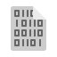
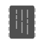

# Papirus Design Notes

The following notes are a synthesis of many informal guidelines for Papirus icon design. They stop short of being an official style guide, and they may change over time.

## Basic concepts

Papirus is an SVG-based icon theme for Linux, drawing inspiration from Material Design and flat design.

All elements are clear, distinct, and have recognisable outlines. Another main feature that distinguishes our theme is its use of warm color tones.

Papirus icons are drawn in layers, moving from dark (down) to light (up).

Objects have a thin highlight (`#ffffff` 20% or 10% for dark icons), and a shadow (always `#000000` 20%). See the template files for more info.

## Main icon sizes

Main icons have the following sizes: 16px, 22px, 24px, 32px and 48px. 64px icons are used for for apps, devices, places and mimetypes.

Excluding their shadows, icon designs as a whole should fit within the following areas, centred on the icon.

| Icon size | Design to | Margin |
| --------- | --------- | ------ |
| 16px      | 16x16     | 0px    |
| 22px      | 20x20     | 1px    |
| 24px      | 20x20     | 2px    |
| 32px      | 28x28     | 2px    |
| 48px      | 40x40     | 4px    |
| 64px      | 56x56     | 4px    |

### Q: Why do we need so many sizes for an SVG?

Because if we use a single size for all then the icons will be blurred at some scales. All objects in Papirus icons need to have pixel alignment.

## Base and foreground shapes

Most Papirus icons have a shaped _base_ or background, and some have a _foreground_ design or logo drawn on top of the base too. Foreground elements like this need their own distinctive outline within the base shape, so there should be a good visual contrast between the base elements and any foreground design.

Base element shapes must look good against both dark and light themes. See the sections below for guidelines about color choice for base elements.

## Shadow and highlight

The base elements of any icon should have a shadow and a highlight. Sometimes foreground elements do as well, if they're fairly large.

Create the shadow by copying the elements you want to shadow, converting them to a single path with _Path → Object/Stroke to Path_ operations, ungroup, and _Union → Path_ in Inkscape, then changing the path's fill color to pure black, 20% object opacity. Move the shadow downwards by the distance in the table below.

Create the highlight shape by copying the shape you made for the shadow twice, moving the top copy down by the distance in the table below, and subtracting it from the top one with _Path → Difference_ in Inkscape. Set the fill color to pure white at 20% object opacity, or 10% if you're putting a highlight on a dark element.

| Icon size | Shadow offset (+y), hilight size (px) |
| --------- | ------------------------------------- |
| 16px      | normally no shadow or highlight       |
| 22px      | 0.5px (use the toolbar text entry)    |
| 24px      | 0.5px                                 |
| 32px      | 1px                                   |
| 48px      | 1px                                   |
| 64px      | 1px                                   |

Shadow and highlight offsets are an exception to the general rule about pixel alignments.

## Selecting colors

Please do not use very bright and toxic colors for Papirus. There is no official Papirus palette, but block colors should be warm-hued, juicy, and not overly saturated.

Good examples colors are available in the main icon theme folders, and you can start with [the example SVG][svgex] in this folder too.

For compatibility with the majority of GTK Themes, we use these brightness limits for base elements. Please don't pick color shades much brighter or darker than these for a base element, and treat these as hard limits for greyscale base elements. This doesn't include shadows and highlights.

- white `#e4e4e4` (HSLuv L* of 91%)
- black `#4f4f4f` (HSLuv L* of 34%)

Suggested colors for object materials: these are especially useful for device icons.

- paper `#e4e4e4`
- steel `#afafb1`
- aluminium `#8e8e8e`
- plastic `#4f4f4f`

[svgex]: ./examples-papirus.svg

## Base element colors

Base elements must be no brighter or darker than the black and white limits above. Papirus icons have to be compatible with a very wide range of GTK themes, some of which use white or pure black backgrounds.

If the base elements are any lighter than `#e4e4e4`, they will tend to disappear into white backgrounds, and this will mess with the shape of the icon. Please avoid base element colors any lighter than the following examples:

    

    

Similarly, base elements that are darker than `#4f4f4f` may be difficult to make out against a black background. Please avoid using base element colors that are any darker then the following examples

    

    

## Foreground element colors

The rules for color selection are a bit more relaxed when you're drawing a foreground element. Logos, text, or other other foreground elements that are fully on top of a base element can use brighter or darker colors than the rules for base elements allow. Put simply, they can be brighter or darker because they are isolated from the themed background color by their base.

Pure `#ffffff` white is in widely accepted, widespread use on top of more vibrantly colored bases, even for quite large shapes:

    

    

Some icons with dark foreground elements use darker colors like `#3f3f3f`. Note that pure black is only ever used for shadows in Papirus.

    

    

The goal here is to create acceptable contrast between base and foreground elements. Consider checking the contrast between the icon's base shape and any foreground elements with a [WCAG 2.0 accessibility checker][checker1]. A rating of "AA" for the _Graphical Objects and User Interface Components_ category is a good minimum target for any logo. Finer designs and text should aim to pass under the _Normal Text_ category instead.

[checker1]: https://webaim.org/resources/contrastchecker/

## Monochrome icons

Papirus now also supports KDE color scheme for monochrome actions, devices, places and panel icons. You can find more detailed info about that [here](https://techbase.kde.org/Development/Tutorials/Plasma5/ThemeDetails#Colors).

Presently we only support the following icons:

- actions (16px, 22px, 24px)
- devices (16px)
- places (16px)
- panel (22px, 24px)

## Gradients

Avoid gradients. There's nothing technically wrong about them, it just isn't the Papirus style. Instead, workarounds are possible when redrawing particularly gradienty upstream icons in the Papirus style. Some examples of icons that evoke complex upsteam gradient with a bit of artistic posterization and some subtle shadows:

   

## Further reading

See the [Papirus wiki][wiki] for some useful guides to icon creation. There are topics in there covering just about every aspect of icon creation workflow, as well as historical information about the project. Anyone can contribute a page, and we'd like it to be as useful as possible!

[wiki]: https://github.com/PapirusDevelopmentTeam/papirus-icon-theme/wiki
